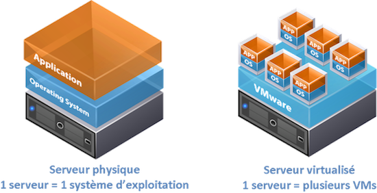

# Les logicielles de virtualisation

faire fonctionner sur une même machine physique, plusieurs systèmes comme s'il fonctionnaient sur des machines physiques distinctes.

plusieurs OS sur lesquelles tourne des application

## hyperviseur : 

Les hyperviseurs sont une couche intermédiaire entre une machine purement virtuelle et la plateforme physique sur laquelle cette machine est installée

* assure le contrôle du processeur et des ressources de la machine hôte.
* alloue à chaque VM (Virtual Machine) les ressources dont elle a besoin.
* s'assure que ces VM n'interfère pas l'une avec l'autre.

type 1 : "bare metal" => un logiciel qui s'execute directement sur le hardaware. outil de contrôle de système d'exploitation => il execute le système d'exploitation => le plus répondu en entreprise.

type 2 : "host metal" logiciel qui s'execute à l'intérieur d'un système d'un système d'exploitation "OS hôte", les OS invités s'execute au 3eme niveau

## différent niveau 

* Si virtualisé s'execute à partir de l'OS => virtualisation de système d'exploitation 
* Si s'execute à partir de l'application => virtualisation d'application

### types de virtualisation d'OS

* l'OS d'un serveur virtualisé dans son ensemble
=> virtualisation de serveur
* l'OS de postes de travail
=> virtualisation de poste de travail

### type de virtualisation de poste de travail

VDI : Virtual Desktop Infrastructure
=> poste de travail hébergé dans un data center

## Hyper-V

### définition

Hyper-V est une technologie de Microsoft qui permet aux utilisateurs de créer des environnements informatiques virtuels, et d'exécuter et gérer plusieurs systèmes d'exploitation sur un seul serveur physique

HyperV => hyperviseur de type 1 de microsoft lançé en 2008 avec window server

comme tous Hyperviseur Hyper V permet de créer/gérer des machines virtuelles (VM) pour par ex:
 
* Développer et tester des applications
* Sauvegarder ou migrer des données depuis un ancien système 

### avantage 

rentable : les entreprise se tourne généralement vers HyperV => il offre des outils de base gratuit
de plus HyperV partage des similitude avec VMware => +adopté

contient déjà des fonctionnalité de base utile :

prend en charge plusieurs système d'exploitation : 

dont linux

autre :

* La possibilité de créer un commutateur virtuel n'entraîne aucun coût supplémentaire
=> permet à toutes vos VM de communiquer, le commutateur va inspecter les paquets de données afin d'acheminer la communication
Sécurité ++

* Simplifie Les migration en directe : 
migration en direct => permet de déplacer un VM d'un d'un hôte HyperV à l'autre sans temps d'arret/en cours d'execution.

* Il s'intègre parfaitement avec les autres produits Microsoft. 

### ES-Xi

VMware ESXi est un hyperviseur de type 1, ou un « hyperviseur bare metal » selon le langage courant, qui peut être installé directement sur un serveur physique et qui peut être utilisé indépendamment du système d’exploitation.

ESX son prédécesseur est un hyperviseur de type 1 => possède son propre système d’exploitation de console. Ceci signifie que cet hyperviseur requiert beaucoup plus de mémoire.

ES-Xi est donc une version plus allégé
=> il offre d'excellent résultats
=> option de répartition optimale
=> permet de travailler en toutes sécuritée sur une ou plusieur machine.

### avantage

* nécéssite moins d'espace de stockage
* la sécuritée après défaillance est assurée
=> aucun inconvénient à la sécurité
* performance élevé / exploitation optimisé des ressource => proximité avec l'appareil
==> les système virtualisés peuvent être facilement exporté
==> La haute souplesse d’utilisation et la rapidité de l’installation sont des avantages intéressants
==> Les coûts sont également réduits quand ESXi est exploité sur des serveurs loués. À ceci s’ajoutent les possibilités de redimensionnement mentionnées.
