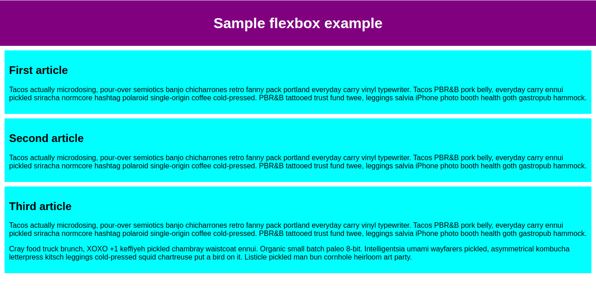
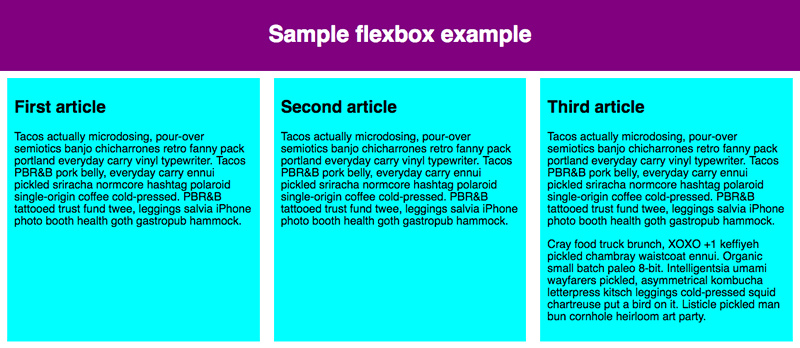
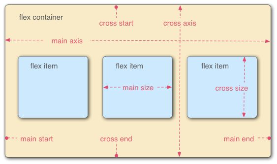

# Flexbox

**Flexbox :** Selon un axe principal permet de disposer des élément en ou en colonne.
Les élément se dilates/contracte pour occuper l'espace disponible.

## Fondamentaux

**Un exemple :**



````
<!DOCTYPE html>
<html lang="en-US">
  <head>
    <meta charset="utf-8">
    <meta name="viewport" content="width=device-width">
    <title>Flexbox 0 — starting code</title>
    <style>
      html {
        font-family: sans-serif;
      }

      body {
        margin: 0;
      }

      header {
        background: purple;
        height: 100px;
      }

      h1 {
        text-align: center;
        color: white;
        line-height: 100px;
        margin: 0;
      }

      article {
        padding: 10px;
        margin: 10px;
        background: aqua;
      }

      /* Add your flexbox CSS below here */


      
    </style>
  </head>
  <body>
    <header>
      <h1>Sample flexbox example</h1>
    </header>

    <section>
      <article>
        <h2>First article</h2>

        <p>Tacos actually microdosing, pour-over semiotics banjo chicharrones retro fanny pack portland everyday carry vinyl typewriter. Tacos PBR&B pork belly, everyday carry ennui pickled sriracha normcore hashtag polaroid single-origin coffee cold-pressed. PBR&B tattooed trust fund twee, leggings salvia iPhone photo booth health goth gastropub hammock.</p>
      </article>

      <article>
        <h2>Second article</h2>

        <p>Tacos actually microdosing, pour-over semiotics banjo chicharrones retro fanny pack portland everyday carry vinyl typewriter. Tacos PBR&B pork belly, everyday carry ennui pickled sriracha normcore hashtag polaroid single-origin coffee cold-pressed. PBR&B tattooed trust fund twee, leggings salvia iPhone photo booth health goth gastropub hammock.</p>
      </article>

      <article>
        <h2>Third article</h2>

        <p>Tacos actually microdosing, pour-over semiotics banjo chicharrones retro fanny pack portland everyday carry vinyl typewriter. Tacos PBR&B pork belly, everyday carry ennui pickled sriracha normcore hashtag polaroid single-origin coffee cold-pressed. PBR&B tattooed trust fund twee, leggings salvia iPhone photo booth health goth gastropub hammock.</p>

        <p>Cray food truck brunch, XOXO +1 keffiyeh pickled chambray waistcoat ennui. Organic small batch paleo 8-bit. Intelligentsia umami wayfarers pickled, asymmetrical kombucha letterpress kitsch leggings cold-pressed squid chartreuse put a bird on it. Listicle pickled man bun cornhole heirloom art party.</p>
      </article>
    </section>
  </body>
</html>

````
Ici on a un ``<header>`` et une ``<section>`` contenant 3 élément ``<article>`` 
Nous allons les utiliser pour créer une disposition vraiment classique sur trois colonnes.

on ajoute :

````
section {
    display: flex;
}

````

On obtient ceci :



**explication :** l'élément display => se comporte comme un bloc dans la page => les enfant se dispose de façon flexible.
Il est possible de définir une valeur a display, par ex :
``flex inline-flex``



Main axis => direction dans laquelles sont disposé les élément flex
cross axis => perpendiculaire a main axis


